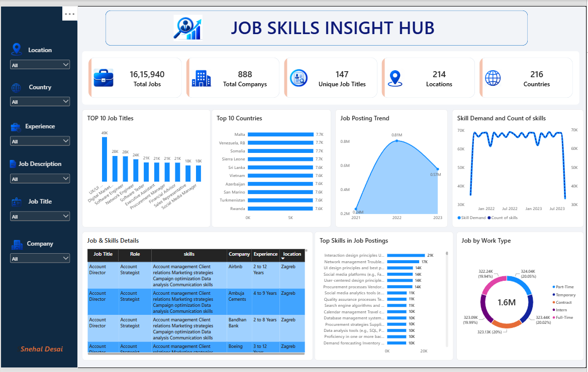

# 📊 Job Skill Extraction from Job Descriptions using NLP

## 📌 Project Overview

**Job Skill Extraction from Job Descriptions using NLP** is an interactive **Power BI dashboard** designed to analyze job-market data and identify the most demanded job skills, job roles, companies, locations, countries, and work types.

The dashboard converts a large job-posting dataset into meaningful business insights that can help **job seekers, recruiters, HR teams, and career analysts** understand current hiring trends and skill demand.

> **Note:** The Power BI project file is large and therefore is hosted externally on Google Drive instead of being uploaded directly to this GitHub repository.

---

## 🎯 Project Objectives

- Analyze a large collection of job postings.
- Identify the most common job titles and roles.
- Analyze skill demand across job postings.
- Understand job distribution by country and location.
- Analyze job-posting trends over time.
- Compare different work types.
- Provide interactive filtering for detailed analysis.
- Build an easy-to-use dashboard for recruitment and career insights.

---

## 📈 Dashboard Overview

The **Job Skill Extraction from Job Descriptions using NLP** dashboard contains the following major sections:

### 🔹 KPI Cards

The dashboard provides high-level recruitment metrics:

| KPI | Value |
|---|---:|
| Total Jobs | **1,615,940** |
| Total Companies | **888** |
| Unique Job Titles | **147** |
| Locations | **214** |
| Countries | **216** |

These KPIs provide a quick overview of the size and diversity of the job-posting dataset.

---

## 📊 Dashboard Visualizations

### 1. Top 10 Job Titles

Shows the most frequently posted job titles and helps identify the roles with the highest demand.

### 2. Top 10 Countries

Displays countries with the highest number of job postings.

### 3. Job Posting Trend

Shows how job-posting volume changes over time and helps identify hiring trends.

### 4. Skill Demand and Count of Skills

Compares skill demand and the number of skills identified across job postings.

### 5. Job & Skills Details

An interactive detailed table containing information such as:

- Job Title
- Role
- Skills
- Company
- Experience
- Location

### 6. Top Skills in Job Postings

Ranks the most frequently occurring skills in job descriptions.

Examples of skills visible in the analysis include:

- Interaction Design
- Network Management
- UI/UX Design
- Social Media
- User-Centered Design
- Procurement
- Quality Assurance
- Search Engine Optimization
- Database Management
- Data Analysis

### 7. Job by Work Type

Shows the distribution of job postings across work types such as:

- Part-Time
- Temporary
- Contract
- Intern
- Full-Time

---

## 🎛️ Interactive Filters

The dashboard provides slicers for:

- **Location**
- **Country**
- **Experience**
- **Job Description**
- **Job Title**
- **Company**

Users can combine multiple filters to perform focused analysis.

For example:

> Select **Country → India** and **Job Title → Data Analyst** to analyze Data Analyst opportunities in India.

---

## 🧠 Key Business Insights

The dashboard can help answer questions such as:

1. Which job titles are most in demand?
2. Which countries have the highest number of opportunities?
3. Which skills appear most frequently in job descriptions?
4. How does job demand change over time?
5. Which companies are posting jobs?
6. What is the distribution of full-time, part-time, contract, internship, and temporary jobs?
7. What experience levels are commonly requested?
8. Which skills should candidates focus on for a particular job role?

---

## 🛠️ Technologies Used

### Data & Programming
- Python
- Pandas
- NumPy

### Data Analysis
- Exploratory Data Analysis (EDA)
- Data Cleaning
- Data Transformation
- Skill Extraction
- Aggregation

### Visualization & BI
- Microsoft Power BI
- Power Query
- DAX
- Interactive Slicers
- KPI Cards
- Bar Charts
- Area Charts
- Line Charts
- Donut Charts
- Tables

### Development Tools
- Jupyter Notebook
- VS Code
- Git
- GitHub

---

## 🔄 Project Workflow

```text
Raw Job Dataset
       ↓
Data Cleaning
       ↓
Data Transformation
       ↓
Skill & Job Data Preparation
       ↓
Exploratory Data Analysis
       ↓
Power BI Data Modeling
       ↓
DAX Measures & KPIs
       ↓
Interactive Visualizations
       ↓
Job Skills Insight Hub
```

---

## 📂 Dataset Information

The project uses a large job-posting dataset containing information related to:

- Job ID
- Experience
- Qualifications
- Salary Range
- Location
- Country
- Work Type
- Job Posting Date
- Preference
- Contact Information
- Job Title
- Role
- Job Portal
- Job Description
- Benefits
- Skills
- Responsibilities
- Company

The cleaned dataset contains approximately **1.6 million job records**.

---

## 📊 Data Preparation

The dataset was prepared before building the Power BI dashboard.

Major data preparation activities included:

- Removing unnecessary records and columns.
- Handling missing values.
- Cleaning text fields.
- Standardizing job-related information.
- Preparing skills for analysis.
- Transforming job-posting dates.
- Creating analysis-ready fields.
- Preparing data for Power BI modeling.

---

## 🧮 Power BI & DAX

Power BI was used to build the interactive analytical dashboard.

DAX was used for calculations such as:

- Total Jobs
- Total Companies
- Unique Job Titles
- Unique Locations
- Unique Countries
- Skill Counts
- Job Posting Trends
- Work Type Distribution

The dashboard uses interactive filters so that users can explore the data dynamically.

---

## 💼 Business Use Case

### Recruitment & HR Teams

Recruiters can use the dashboard to identify:

- High-demand skills
- Popular job roles
- Geographic hiring trends
- Work-type distribution
- Companies and hiring patterns

### Job Seekers

Candidates can use the analysis to understand:

- Which skills are currently in demand.
- Which job titles have more opportunities.
- Which technologies and skills frequently appear in job descriptions.
- Which countries and locations have more opportunities.

### Career Analysts

The dashboard can be used to study:

- Job-market trends
- Skill demand
- Role popularity
- Geographic distribution
- Hiring patterns

---

## ⭐ Key Highlights

- **1.6M+ job postings analyzed**
- **888 companies**
- **147 unique job titles**
- **214 locations**
- **216 countries**
- Interactive Power BI dashboard
- Skill-demand analysis
- Job trend analysis
- Work-type analysis
- Dynamic slicers and filtering
- Business-focused KPIs

---

## 📷 Dashboard Preview



---

## 📥 Power BI Project File

Because the Power BI project file is large, the complete file is hosted on Google Drive.

### 👉 [Open / Download Power BI Project](https://drive.google.com/file/d/128B-PUFWqAQ18XqbCACbJDyER5iz18t6/view?usp=sharing)

You can use the Google Drive link to access the complete Power BI project file.

---

## 🚀 How to Use the Dashboard

1. Open the Power BI project file from the Google Drive link.
2. Open it using **Microsoft Power BI Desktop**.
3. Allow the dataset to load.
4. Use the slicers on the left side to filter the analysis.
5. Explore KPIs and visualizations.
6. Select different job titles, countries, locations, companies, or experience levels to perform detailed analysis.

---

## 📌 Example Analysis

### Example: Data Analyst Skills

A recruiter wants to identify the skills required for Data Analyst positions.

They can:

```text
Job Title → Data Analyst
        ↓
Filter Dashboard
        ↓
View Top Skills
        ↓
Analyze Experience
        ↓
Compare Locations
        ↓
Identify Hiring Trends
```

This provides a quick view of the skills and job-market characteristics associated with the selected role.

---

## 🔮 Future Enhancements

Future versions of the project can include:

- NLP-based automatic skill extraction.
- AI-powered job recommendation.
- Skill gap analysis.
- Salary analysis.
- Job-role recommendation.
- Resume-to-job matching.
- Predictive hiring trends.
- Power BI Service deployment.
- Automated data refresh.
- Real-time job-market data.

---

## 👩‍💻 Author

**Snehal Desai**

**Data Analyst | Power BI | SQL | Python | DAX | Data Visualization**

---

## 🏷️ Project Tags

`Power BI` `Data Analytics` `Job Market Analysis` `Job Skills` `Skills Analysis` `DAX` `Power Query` `Python` `Pandas` `Data Visualization` `Business Intelligence` `Recruitment Analytics` `HR Analytics`

---

## 📄 License

This project is created for **educational, portfolio, and data-analytics demonstration purposes**.
